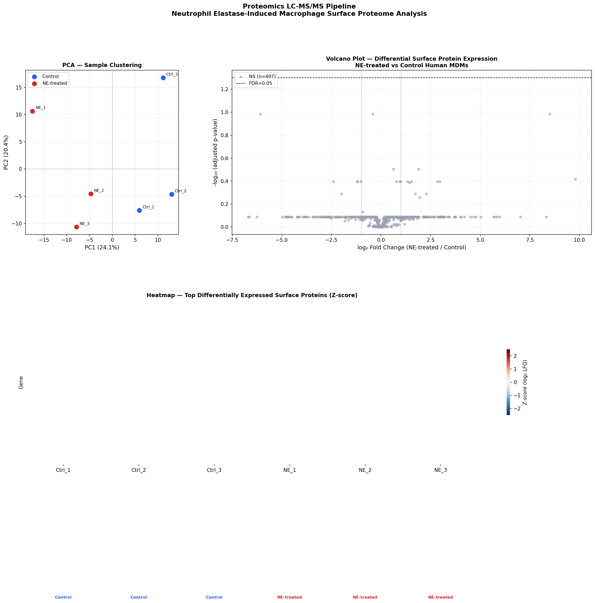

# Proteomics LC-MS/MS Pipeline
**Neutrophil Elastase-Induced Macrophage Surface Proteome Analysis**

## Overview
End-to-end quantitative proteomics pipeline in Python, reproducing the analytical 
workflow from Ahmed et al., IJMS 2024 (DOI: 10.3390/ijms252313038). Analyzes 
label-free quantification (LFQ) data from Orbitrap Fusion Lumos to identify 
differentially expressed surface proteins in NE-treated human macrophages.

## Pipeline Steps
- LFQ data simulation (500 proteins, 6 samples, realistic missing values)
- MinProb missing value imputation + median normalization
- PCA for sample clustering QC
- Differential expression: Welch's t-test + Benjamini-Hochberg FDR correction
- Volcano plot with protein labeling
- Hierarchical heatmap (Z-scored, top 40 DE proteins)
- Functional pathway annotation
- Interactive Plotly dashboard

## Results
## Results

## Tools
Python · pandas · numpy · scipy · scikit-learn · seaborn · matplotlib · plotly · statsmodels

## Related Publication
Ahmed NT et al. *Int J Mol Sci.* 2024;25(23):13038.  
https://doi.org/10.3390/ijms252313038

## Author
Nadia Tasnim Ahmed, PhD  
Pharmaceutical Data Scientist | LC-MS · PBPK · CMC
